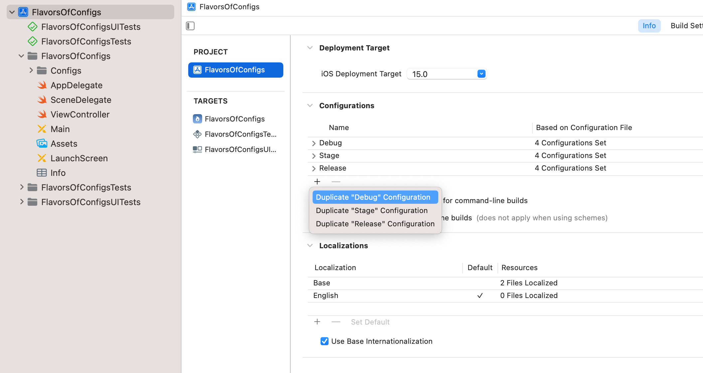

# Different flavors of an app for different targets.

Wouldn't that be great if you could make your app run in different modes?
for instance, a QA or Staging, a Testing, Release mode or any other mode with any specific criteria.
well, here in this little project, I'll show case that.


you just need to follow these steps:

First, you need to create a new configuration, which you can do by going to the Project, then info tab, like in th following screenshot. you would duplicate the one configuration tha is closer to your desired one. For instance you need a configuration for QA, duplicating the Debug would be good choice.


<p float="center">

</p>

Next, you need to create an xcconfig file for each otther configurations. For clarity it's better to name the files accordingly, make a directory/folder/group called Configs, put all the configurations there.<br/> What you write in the xcconfig, is just a reflection of the settings you have in the build settings, meaning you can call those settings, set values to them. Create variable (which is a good practice for Not Repeating yourself over and over), assign value to them and call them afterwards or in other xcconfig files.<br/> For this very pupose (Not Repeating yourself) it is good to have a Base xcconfig file that you can put all the necessary settings there, and reuse or override them in other places.<br/>For instance, you'd like to have your app with different names according to what `Build Configuration` is under execution. Or have your QA flavor of the app, have a name like `Flavor-QA`.<br/>For that, do the following in the Base xcconfig file:
```
APP_NAME = Flavors
```
the in the QA xcconfig, right after importing the settings in the Base config, do the following:
```
#include "Base.xcconfig"

APP_NAME = $(inherited)-QA
```
the `$(inherited)` fetches the value of `APP_NAME` from the Base config.

To have your app showing the desired name (aka display name), you need to add a setting in the `info` plist file of your project.
`Bundle display name` and set its value to `$(APP_NAME)`.<br/> Now you need to change the Build Configuration in the scheme editor to your configuration, let's say QA.<br/> after doing so, build and run, you should see that the name of your app following what you set in the xcconfig file. 
