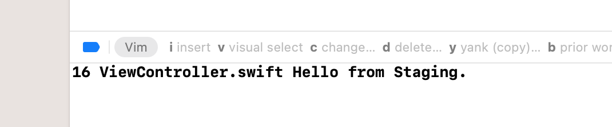
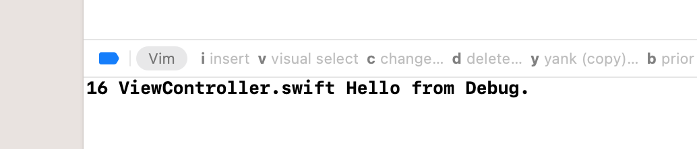
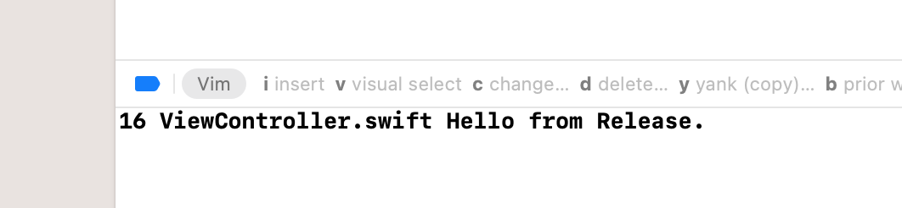

# Different flavors of an app for different targets.

Wouldn't that be great if you could make your app run in different modes?
for instance, a QA or Staging, a Testing, Release mode or any other mode with any specific criteria.
well, here in this little project, I'll show case that.


you just need to follow these steps:

First, you need to create a new configuration, which you can do by going to the Project, then info tab, like in th following screenshot. you would duplicate the one configuration tha is closer to your desired one. For instance you need a configuration for QA, duplicating the Debug would be good choice.


<p float="center">

</p>

Next, you need to create an xcconfig file for each otther configurations. For clarity it's better to name the files accordingly, make a directory/folder/group called Configs, put all the configurations there.<br/> What you write in the xcconfig, is just a reflection of the settings you have in the build settings, meaning you can call those settings, set values to them. Create variable (which is a good practice for Not Repeating yourself over and over), assign value to them and call them afterwards or in other xcconfig files.<br/> For this very pupose (Not Repeating yourself) it is good to have a Base xcconfig file that you can put all the necessary settings there, and reuse or override them in other places.<br/>For instance, you'd like to have your app with different names according to what `Build Configuration` is under execution. Or have your QA flavor of the app, have a name like `Flavor-QA`.<br/>For that, do the following in the Base xcconfig file:
```
APP_NAME = Flavors
```
the in the QA xcconfig, right after importing the settings in the Base config, do the following:
```
#include "Base.xcconfig"

APP_NAME = $(inherited)-QA
```
the `$(inherited)` fetches the value of `APP_NAME` from the Base config.

To have your app showing the desired name (aka display name), you need to add a setting in the `info` plist file of your project.
`Bundle display name` and set its value to `$(APP_NAME)`.<br/> Now you need to change the Build Configuration in the scheme editor to your configuration, let's say QA.<br/> after doing so, build and run, you should see that the name of your app following what you set in the xcconfig file. 


But... nothing happened,  right? You don't see what you expected, not cool, I know.<br/> The reason is, you need to set up a different Bundle Identifier for your configuration, in order to be able to run all the Build Configurations separately and be able to distinguish them from one another.<br/>
For that, do the following in the Base xcconfig file:

```
BASE_BUNDLE_IDENTIFIER = TheBundleIdentifierOfYourApp OR xyz.domain.yourProjectName

PRODUCT_BUNDLE_IDENTIFIER = $(BASE_BUNDLE_IDENTIFIER)
```

The first line is declaring a variable to hold the bundle id of your app. The second line which is just a setting in your app's target, build setting, in the packaging section, is what that makes idea of having multiple flavors of your app at once available.<br/> Next you need to override the `PRODUCT_BUNDLE_IDENTIFIER` in your QA xcconfig to:

```
BASE_BUNDLE_IDENTIFIER = com.TheAlienMann.Stranger

PRODUCT_BUNDLE_IDENTIFIER = $(BASE_BUNDLE_IDENTIFIER).qa
```

Next, in the Targets, find your app, select the `Build Settings` tab, find `Packaging` section, here you need to find `Product Bundle Identifier` and change its value to:
`$(inherited)`. Change the build configuration to QA in the scheme editor (or just hit cmd + option + R), and run the app, you'll see that the app name has changed with a "QA" appeneded to it!

Next, It would be nice if you could set a different icon for each of the build configurations, right? well, luckily you can do that as well pretty easily.<br/>But first let's create some icons! This app, [Bakery](https://apps.apple.com/de/app/bakery-simple-icon-creator/id1575220747?l=en-GB&mt=12), is a very useful one for creating app icons. The templates it's provided, can help you create app icon for your different build configurations, in a way that they are distingushable by a label or badge on the label which reflects the build configuration.<br/> Create your desired app icon, import it to xcode, just make sure you rename it to what you have sat up in your configuration file.<br/>To make things work, the appropriate icon show up for the right build configuration, you need to add `Bundle display name` to the `info.plist` of the project. Set its value to `$(inherited)`. Now, change the build configuration to QA in the scheme editor and build and run. You should see your app with a differrent app icon.


<p float="center">

</p>

You probably ask what else can I do with xcconfigs. Well, there's so much you can do.<br/> For instance, when you're hitting an API endpoint, you'd like to hit a different endpoint for testing purposes or for the QA. Yes, you can set up your API endpoints in the xcconfig, a different route for each build configuration, and call the related one while running a specific build configuration.

I will demonstrate this with a literal string and print it in the console which can help to get the gist of the URLSession request call with a URL.

I am going to declare a variblae in the Base xcconfig as `SAMPLE_STRING` assign the value `Hello from ` to it. Then I'll call the same variable in other configs, for instance Debug, and i will assign `$(inheited) Debug.` to it for the Debug configutation. You will do the same for other configutations.<br/> Next, in the viewController's viewDidLoad, you will do the following:

```
    guard let infoDictionary = Bundle.main.infoDictionary else { return }
    guard let sampleString = infoDictionary["SAMPLE_STRING"] as? String else { return }
    print(#line, #file.components(separatedBy: "/").last!, sampleString)
```

Change the build configuration in the scheme editor (CMD + Option + R) to any of the the configutations, and build and run. You will see the related message is being printed in the console, like the following:

<p float="center">



<p/>